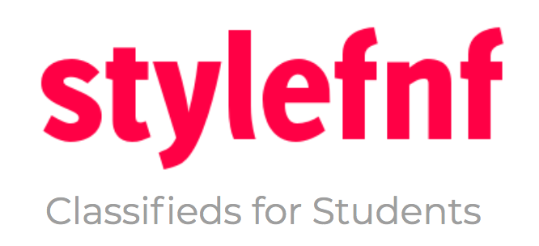

Stylefnf is Canada’s online classifieds platform for students. We provide college students with a smarter, simpler and safer way to buy and sell locally.

## The Hatchery Startup Incubator (Summer 2016)

Stylefnf participated in the [The UofT Entrepreneurship Hatchery](https://hatchery.engineering.utoronto.ca/) Summer 2016 cohort and was selected to compete in Demo Day in Sept 2016.

Here's a link to the presentation details:

[Stylefnf Pitch](https://docs.google.com/presentation/d/1OdAz7aCN9kP5x9B1W18MNU6kAplWTWqU2Gnk6d1iXlg/edit?usp=sharing)

[Stylefnf Pitch Deck](https://docs.google.com/presentation/d/1OdAz7aCN9kP5x9B1W18MNU6kAplWTWqU2Gnk6d1iXlg/edit?usp=sharing)

## Technical Details

Stylefnf is built off the [MEAN (MongoDB, Express.js, Angular.js and Node.js) stack](http://mean.io/).

The mobile app (Android + iOS) is built off [Ionic framework](https://ionicframework.com/).
